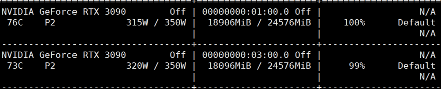
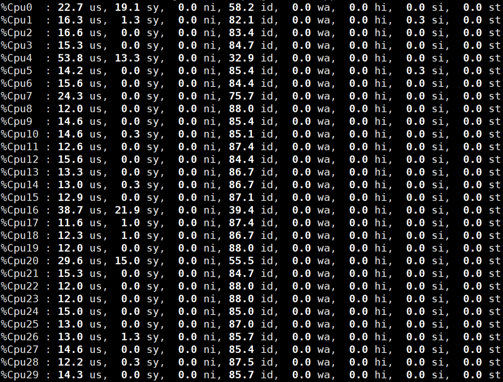
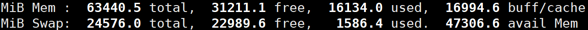
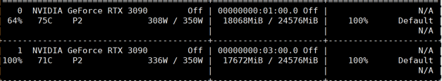

# Spatial Prior-Driven Diffusion for Visual Reconstruction from Sparse EEG

## Authors

Hui Ma ([ORCID: 0009-0007-6641-4627](https://orcid.org/0009-0007-6641-4627)), Yue Zhou ([ORCID: 0009-0006-9839-2947](https://orcid.org/0009-0006-9839-2947), Member, IEEE), Xiaofang Hu ([ORCID: 0000-0003-3764-2640](https://orcid.org/0000-0003-3764-2640), Member, IEEE), Yuhai Li, and Shukai Duan ([ORCID: 0000-0002-0040-3796](https://orcid.org/0000-0002-0040-3796), Member, IEEE)

## Abstract

Reconstructing visual stimuli from electroencephalogram (EEG) signals represents a significant frontier in deciphering the functional mechanisms of the human brain. Current methodologies predominantly rely on unimodal EEG data to guide conditional generative models. However, these approaches often overlook the intrinsic spatial priors within EEG signals. Such heavy dependence on unimodal data necessitates high-density electrode arrays and extensive pre-training on auxiliary datasets, thereby hindering the practical deployment of these technologies. In this paper, we propose a Spatial Prior-driven Diffusion (SPD) model specifically designed to reconstruct visual stimuli from low-density EEG. By integrating 4D prior positional encoding, a spatio-temporal hybrid model, and random electrode masking, our method enhances the model's capacity to learn spatial priors. This enables the conditional module to extract robust feature representations from sparse EEG configurations, which effectively guide the diffusion process to generate target images. Under the experimental setting with an electrode masking ratio of $R = 0.75$, 75% of the channels are masked and the remaining 25% are used as model input. Under this setting, SPD achieves a reconstruction accuracy of 62.5% without pre-training on auxiliary datasets. Both quantitative and qualitative evaluations validate the efficacy of the proposed method.

The code is available at [https://github.com/mahui-HUE/SPD](https://github.com/mahui-HUE/SPD).
The checkpoint file is https://drive.google.com/file/d/1rk2ONLxSS370yXvLY9seB43DjObD_A-y/view?usp=drive_link
## Resource Usage

### Two Concurrent Pre-training Tasks

#### GPU Memory Usage and Utilization

#### CPU Usage

#### System Memory Usage

### Two Concurrent Joint-training Tasks

#### GPU Memory Usage and Utilization

## Acknowledgements

This repository is based on
[DreamDiffusion](https://github.com/bbaaii/DreamDiffusion),
originally developed by bbaaii and released under the MIT License.

This fork includes modifications to EEG channel masking, spatial priors,
brain-region encoding, model architecture, dataset support, and evaluation.
